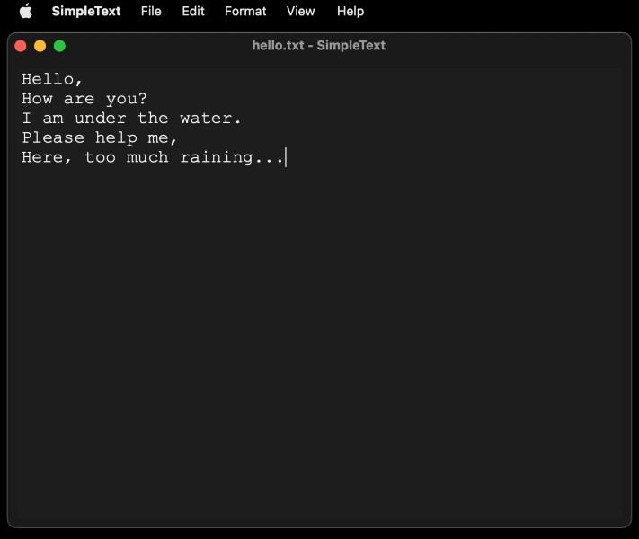
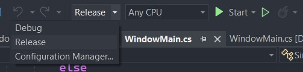

# SimpleText
An extremely simple plain text editor.  

- [Download](#download)
	- [Installation](#installation)
	- [System Requirements](#system-requirements)
- [Usage](#usage)
	- [Interface](#interface)
	- [App Menu](#app-menu)
	- [File Menu](#file-menu)
	- [Edit Menu](#edit-menu)
	- [Format Menu](#format-menu)
	- [View Menu](#view-menu)
	- [Help Menu](#help-menu)
- [Building](#building)
	- [Source Code](#source-code)
	- [Windows - 32 Bit](#windows---32-bit)
	- [macOS](#macos)
- [Credits](#credits)

## Download
**Windows**:  
- [Download for Windows](https://github.com/ganeshh123/SimpleText/releases/download/1.1.0/SimpleText-win32_setup-1_1_1.exe)
- [Download for Windows (Portable)](https://github.com/ganeshh123/SimpleText/releases/download/1.1.0/SimpleText-win32-1_1_1.zip)

**macOS**:  
- [Download for macOS](https://github.com/ganeshh123/SimpleText/releases/download/1.1.0/SimpleText-macOS-1_1_1.zip)

**Older Versions**:
- [All Releases](https://github.com/ganeshh123/SimpleText/releases)

### Installation

**Windows**:
- Open the downloaded setup file and follow instructions to install
- Open `SimpleText` from the start menu

**macOS**:
- Extract the downloaded zip file with archive utility
- Drag `SimpleText.app` into the `Applications` folder
- Open `SimpleText` from the launchpad

### System Requirements

**Windows**:   
- Windows 10 (1903+), Windows 11
- Windows 7, Windows 8 with [.NET Framework 4.8 Runtime](https://support.microsoft.com/en-us/topic/microsoft-net-framework-4-8-offline-installer-for-windows-9d23f658-3b97-68ab-d013-aa3c3e7495e0) installed

**macOS**:  
- macOS 10.12 Sierra or later
- OSX 10.9 Mavericks or later

## Usage  

### Interface
The user interface consists of three parts - the title bar, the menu bar, and the editor:

**Windows:**  
  

**macOS:**  
 

- **Title Bar** - The title bar at the top of the window provides the standard options to minimize, change the size, and close the application window. If an existing file has been opened in the application, it's name is shown in the title bar.
- **Menu Bar** - The menu bar is used to carry out various operations to the document, separated into six sections. In Windows, the menu bar is located at the top of each window, while in macOS the menu bar is located at the top of the screen. Keyboard shortcuts to perform the options are shown in the option's button (if applicable).
- **Editor** - The editor is where text information can be written or edited. Just click inside it and start writing.
	- The cursor (blinking line) indicates the position at which new characters will be inserted.
	- A selection can be made to perform operations to specific text in the editor. To select some text, click the mouse down, drag over it and release the mouse. Selected text will be highlighted in blue. To cancel the selection, click in the editor outside the highlighted area.

### App Menu
The App menu (called SimpleText in the menu bar) provides options for managing the application:

- **About** - Opens a window showing the application version and credits.
- **License** - Opens the application's license and terms of use in a web browser.
- **Check for Updates** - Opens a page where new versions of the application are published, in a web browser.
- **Report Bug** - Opens the application's issue tracker page in a web browser, where bugs and issues can be reported.
- **Quit** - Closes all instances of the application, including other windows.

### File Menu
The "File" menu provides options for loading and saving files:
- **New** - Opens a new instance of the program to create/work with multiple documents independently.
- **Open** - Allows a text file to be chosen from the file system, to be loaded into the editor. By default only files with the `.txt	` extension are shown, but the filter can be changed to show All Files to open other plain text formats, such as `.ini` and `.md`.
- **Save** - Allows the text document in the editor to be saved into a file.
	- If an existing document is being edited, it will be over-written with the contents in the editor.
	- If a new document is being edited, a window will open to choose a location in the file system to save the document, and to give it a file name.
- **Save As** - Allows the document to be saved to the file system with a specific name or location.

### Edit Menu
The "Edit" menu provides options to perform operations on text in the editor:

- **Undo** - Reverses the last action performed in the editor.
- **Redo** - Re-applies the last action that was "undone".
- **Cut** - Removes the selected text from the editor, and places it in the clipboard.
- **Copy** - Places the selected text from the editor onto the clipboard, without removing it from the editor.
- **Paste** - Adds the text-content in the clipboard (if any) to the editor at the location of the cursor.
- **Delete** - In the editor:
	- If text is selected, the selected text is erased.
	- If text is not selected, the character to the right of the cursor is erased.
- **Select All** - Selects all text content in the editor.

### Format Menu
The "Format" menu provides options to specify the layout of the text  in the editor:

- **Font** - Opens a window to select a typeface and text size for text displayed in the editor.
- **Word Wrap** - Specifies whether text content that goes outside of the window horizontally should be "wrapped" underneath. The tick indicates whether this option is enabled.

### View Menu
The "View" menu provides options to configure the display of the application:

- **Zoom In** - Increases the size of text in the editor.
- **Zoom Out** - Decreases the size of text in the editor.
- **Reset Zoom** - Sets the size of the text in the editor to the default value.
- **Dark Background** - Applies a dark background to the program. This option is enabled by default if your Operating System is set to use the Dark Theme. This option only works on macOS 10.14 Mojave or later.

### Help Menu
The "Help" menu has only one option:

- **View Help** - Opens the usage instructions for the application in a web browser.

## Building
### Source Code
- Repository: [ganeshh123/SimpleText](https://github.com/ganeshh123/SimpleText/)
- Zip Download: [SimpleText-main.zip](https://github.com/ganeshh123/SimpleText/archive/refs/heads/main.zip)
- HTTPS Clone: `https://github.com/ganeshh123/SimpleText.git`
- SSH Clone: `git@github.com:ganeshh123/SimpleText.git`

### Windows - 32 Bit
1. Download the source code as a zip and extract, or clone the repository.
2. Install [Visual Studio](https://visualstudio.microsoft.com/vs/community/) on a Windows machine, with the ".NET desktop development" workflow:   
	
4. Open `win32/SimpleText.sln` from the project folder in Visual Studio.
5. Choose "Release" in the target configuration:  
	
6. Open the "Build" menu and choose "Build Solution":  
	
7. Once the build is completed, the executable can be found at `win32/bin/Release/SimpleText.exe` in the project folder.

### macOS
1. Download the source code as a zip and extract, or clone the repository.
2. Install [Xcode](https://xcodereleases.com/) on a macOS machine.
3. Open `macOS/SimpleText.xcodeproj` from the project folder in Xcode.
4. Open the "Product" menu and choose "Archive":  
	
5. Once building is complete, select the created archive and choose "Distribute App".
6. Choose "Copy App" and select a location to export the zip file to.
7. Extract the zip file to find the executable `SimpleText.app`.

## Credits
Icon by [Joseph Hutchinson](https://github.com/jwhutchinson)
